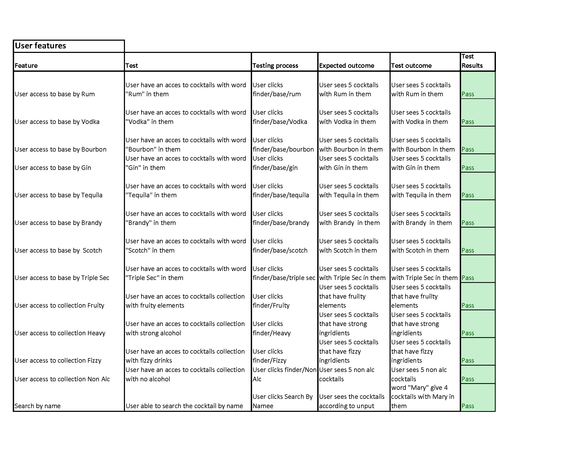

## 3 T3A2-B Full Stack App
# Shkr! app <br/><br/>

A MERN Application built by Patrick Hamer and Anastasia Dyakova(aka Nassy Kova)
<br>
 [Patrick Hamer](https://github.com/Patrick655321)
<br>
 [Nassy Kova](https://github.com/NassyKova/)


## App description

### Purpose

### Functionality / Features

### Target audience

?????
#

## Links

Deployed Application: [https://link](https://link)

Staging Environment: [https://link](https://link)

Server Repo: [https://github.com/Patrick655321/Shakr--Backend](https://github.com/Patrick655321/Shakr--Backend)

Client Repo: [https://github.com/NassyKova/shkr_frontend](https://github.com/NassyKova/shkr_frontend)

Part A Documentation: [https://github.com/NassyKova/Cocktail](https://github.com/NassyKova/Cocktail)


### System requirements

- NodeJS version v18.12.1


### Server Installation

- Create a directory called `shkr_front` and navigate into that directory.
  - `$ mkdir shkr_back && cd shkr_back`
- Once in the `/shkr_back` directory, in the terminal run the following command:
  - `git clone git@github.com:Patrick655321/Shakr--Backend.git`
- Install npm packages
  - `npm install`
- If a `.env` file has not been provided to you, create one and fill it out using the fields provided in the `.env.sample` file
- Run the server with the following command:
  - `npm run dev`
- This will run the server using nodemon

The API can now be accessed using Postman and `localhost:3000/`

### Client Installation

- Open the terminal and navigate to the `shkr_front` folder
  - `$ cd shkr_front`
- Once in the `/shkr_front` directory, in the terminal run the following command:
  - `git clone git@github.com:NassyKova/shkr_frontend.git`
- Install npm packages
  - `npm install --legacy-peer-deps`
- run the server with the following command:
  - `npm run dev`
- By default the server will run at `http://localhost:5000/`

## API Endpoints

drinkRouter.get("/drinks/name/:drinkName", getDrinkByName);

    Request Verb: GET
    Function: Retrieves 5 random cocktails by name entered by user (eg Margarita will return all drinks with that string in their name)
    Authentication: N/A
    Authorization: N/A
    Example Response:
```Javascript
{
  "drinks": [
    {
      "strDrink": "Whitecap Margarita",
      "strInstructions": "Place all ingredients in a blender and blend until smooth. This makes one drink.",
      "strDrinkThumb": "https://www.thecocktaildb.com/images/media/drink/srpxxp1441209622.jpg",
      "strIngredient1": "Ice",
      "strIngredient2": "New tequila brand",
      "strIngredient3": "Cream of coconut",
      "strIngredient4": "Lime juice",
      "strMeasure1": "1 cup ",
      "strMeasure2": "2 oz ",
      "strMeasure3": "1/4 cup ",
      "strMeasure4": "3 tblsp fresh "
    },
 ```

drinkRouter.get("/drinks/base/:drinkBase", getDrinkByBase);
    Request Verb: GET
    Function: Retrieves 5 random cocktails by selected base ingredient (buttons on client side)
    Authentication: N/A
    Authorization: N/A
    Example Response:
    ```Javascript
    {
    "drinks": [
        {
            "strDrink": "Barracuda",
            "strInstructions": "Shake pour ingredients with ice. Strain into glass, top with Sparkling wine.",
            "strDrinkThumb": "https://www.thecocktaildb.com/images/media/drink/jwmr1x1504372337.jpg",
            "strIngredient1": "Mount Gay Eclipse",
            "strIngredient2": "Galliano",
            "strIngredient3": "Pineapple Juice",
            "strIngredient4": "Lime Juice",
            "strIngredient5": "Prosecco",
            "strMeasure1": "4.5 cl",
            "strMeasure2": "1.5 cl",
            "strMeasure3": "6 cl",
            "strMeasure4": " 1 dash",
            "strMeasure5": "top up "
        },```


drinkRouter.get("/drinks/non-alc", getDrinkByNonAlc);
Request Verb: GET
    Function: Retrieves 5 random cocktails from the non-alcoholic list in the external API
    Authentication: N/A
    Authorization: N/A
    Example Response:

```Javascript
{
    "drinks": [
        {
            "strDrink": "Grape lemon pineapple Smoothie",
            "strInstructions": "Throw everything into a blender and liquify.",
            "strDrinkThumb": "https://www.thecocktaildb.com/images/media/drink/54z5h71487603583.jpg",
            "strIngredient1": "Grapes",
            "strIngredient2": "Lemon",
            "strIngredient3": "Pineapple",
            "strMeasure1": "1 cup ",
            "strMeasure2": "1/4 ",
            "strMeasure3": "1/2 "
        },
```

drinkRouter.get("/drinks/fruity", getDrinkByFruity);
Request Verb: GET
    Function: Retrieves 5 random cocktails that contain an ingredient that is included in the fruityList in utils/arrayInfo
    Authentication: N/A
    Authorization: N/A
    Example Response:
```Javascript
{
    "drinks": [
        {
            "strDrink": "Lassi - Mango",
            "strInstructions": "Put it all in a blender and pour over crushed ice. You can also use other fruits like strawberries and bananas.",
            "strDrinkThumb": "https://www.thecocktaildb.com/images/media/drink/1bw6sd1487603816.jpg",
            "strIngredient1": "Mango",
            "strIngredient2": "Yoghurt",
            "strIngredient3": "Sugar",
            "strIngredient4": "Water",
            "strMeasure1": "2 ",
            "strMeasure2": "2 cups ",
            "strMeasure3": "1/2 cup ",
            "strMeasure4": "1 cup iced "
        },
```


drinkRouter.get("/drinks/fizzy", getDrinkByFizzy);
Request Verb: GET
    Function: Retrieves 5 random cocktails that contain an ingredient that is included in the fizzyList in utils/arrayInfo
    Authentication: N/A
    Authorization: N/A
    Example Response:
```Javascript
{
    "drinks": [
        {
            "strDrink": "Brandon and Will's Coke Float",
            "strInstructions": "Scoop two large scoops of vanilla ice-cream into frosted beer mug. Next, add 2 ounces Maker's Mark. Then, pour in coke. Gently stir and enjoy.",
            "strDrinkThumb": "https://www.thecocktaildb.com/images/media/drink/xspxyr1472719185.jpg",
            "strIngredient1": "Vanilla ice-cream",
            "strIngredient2": "Coca-Cola",
            "strIngredient3": "Woodford Reserve",
            "strMeasure1": "2 scoops ",
            "strMeasure2": "1 can ",
            "strMeasure3": "2 oz "
        },
```
drinkRouter.get("/drinks/heavy", getDrinkByHeavy);
Request Verb: GET
    Function: Retrieves 5 random cocktails that contain an at least one alcoholic ingredient and no more than 3 ingredients.
    Authentication: N/A
    Authorization: N/A
    Example Response:
```Javascript
{
    "drinks": [
        {
            "strDrink": "Addison Special",
            "strInstructions": "Combine ingredients in the order listed into a shaker. Fill half full with ice and shake well. Strain into glass with ice and garnish with a cherry and orange wedge.",
            "strDrinkThumb": "https://www.thecocktaildb.com/images/media/drink/4vo5651493068493.jpg",
            "strIngredient1": "Grey Goose",
            "strIngredient2": "Grenadine",
            "strIngredient3": "Orange juice",
            "strMeasure1": "1 shot ",
            "strMeasure2": "1 tblsp ",
            "strMeasure3": "Fill with "
        },
```

<!-- returnModRouter.get("/products", getProducts) -->
returnModRouter.put("/products/brand/:id", rebrandSpirit)
Request Verb: PUT
    Function: Assigns new value (req.body.newBrand) to appropriate key (req.body.spiritName)
    Authentication: N/A
    Authorization: N/A
    Example Response:
    ```Javascript
    {
    "_id": "6408199ef6eeb96704d4269b",
    "vodka": "Belvedere",
    "rum": "Mount Gay",
    "scotch": "Ballentine's",
    "bourbon": "Woodford Reserve",
    "tequila": "El Jimador",
    "gin": "Beefeater",
    "forbidden": [
        "Martini",
        "margarita",
        "Dirty Martini"
    ]
}
```
    
returnModRouter.post("/products/forbidden/add", addToForbidden)
Request Verb: POST
    Function: Adds item (req.body.drink) to forbidden list
    Authentication: N/A
    Authorization: N/A
    Example Response:
        ```Javascript
    {
    "_id": "6408199ef6eeb96704d4269b",
    "vodka": "Grey Goose",
    "rum": "Mount Gay",
    "scotch": "Ballentine's",
    "bourbon": "Woodford Reserve",
    "tequila": "El Jimador",
    "gin": "Beefeater",
    "forbidden": [
        "Martini",
        "margarita",
        "Dirty Martini"
        "${req.body.drink}"
    ]
}
```

returnModRouter.patch("/products/forbidden/remove", removeForbiddenItem)
Request Verb: PATCH
    Function: removes item (req.body.drink) from forbidden list
    Authentication: N/A
    Authorization: N/A
    Example Response:
    ```Javascript
    {
    "_id": "6408199ef6eeb96704d4269b",
    "vodka": "Grey Goose",
    "rum": "Mount Gay",
    "scotch": "Ballentine's",
    "bourbon": "Woodford Reserve",
    "tequila": "El Jimador",
    "gin": "Beefeater",
    "forbidden": [
        "Martini",
        "margarita",
        "Dirty Martini"
    ]
}
```


## Server Libraries and Dependencies

### Server Libraries

`mongoose ^6.8.4"`- Mongoose is a MongoDB object modeling tool designed to work in an asynchronous environment. Mongoose supports Node.js and Deno (alpha).

`express ^4.18.2` - Express is a minimal and flexible Node.js web application framework that provides a robust set of features for web and mobile applications.

`dotenv ^16.0.3` - Dotenv is a zero-dependency module that loads environment variables from a .env file into process.env. Storing configuration in the environment separate from code is based on The Twelve-Factor App methodology.

`cors ^2.8.5"` - CORS is a node.js package for providing a Connect/Express middleware that can be used to enable CORS with various options.

`axios ^1.3.4` - Axios is promise-based HTTP client for javascript. It is a simpler way to modify request/response before they have started as well as being able to transform the data (eg. automatically stringifies data when sending objects to API).

`moment ^2.29.4` - Moment is a library that simplifies the handling, manipulation and presentation of date/time in a human-readable form.

### Server Development Dependencies

`jest ^29.4.1` - Jest is a JavaScript testing framework that allows developers to run tests on JavaScript and TypeScript code and can be easily integrated with React JS.

<!-- `supertest ^6.3.3` - A Node.js library for testing APIs. Provides high level abstraction for testing. -->

`nodemon ^2.0.20` - Nodemon is a popular tool that is used for the development of applications based on node. js. It simply restarts the node application whenever it observes the changes in the file present in the working directory of your project.

## Client Libraries and Dependencies

### Client Libraries

`react: ^18.2.0` - React is a free and open-source front-end JavaScript library for building user interfaces based on components. It is maintained by Meta and a community of individual developers and companies.

`react-dom: ^18.2.0` - The react-dom package provides DOM-specific methods that can be used at the top level of your app and as an escape hatch to get outside the React model if you need to.

`react-router-dom: ^6.8.1` - React-router is the core package containing standard components and functionalities to implement routing in React applications.

`react-bootstrap: "^2.7.2`- React-Bootstrap replaces the Bootstrap JavaScript. Each component has been built from scratch as a true React component, without unneeded dependencies like jQuery

`axios: "^1.3.4` - Axios is used to communicate with the backend and it also supports the Promise API that is native to JS ES6.


`react-scripts: "5.0.1"` - React-scripts are simply scripts to run the build tools required to transform React JSX syntax into plain JavaScript programmatically.

`styled-components: "^5.3.6"` - Using tagged template literals and arrow functions in ES6+ and CSS, styled-components is a React-specific CSS-in-JS styling solution that creates a platform for developers to write actual CSS code to style React components, as well as in React Native.


Component libraries:
- `mui` - @mui/material: ^5.11.10,
- `antd` - antd: ^5.2.1,
- `emotion` - @emotion/react: "^11.10.5, @emotion/styled: ^11.10.5,


### Client Development Dependencies

`vite": "^4.0.0` - Vite allows developers to setup and build a front-end development environment for React that contains a dev server. It also has the feature of a Hot Module Reload which updates the server with changes to the codebase.

`@testing-library/jest-dom: ^5.16.5`

`@testing-library/react: ^13.4.0`

`@types/react: ^18.0.26`

`@types/react-dom: ^18.0.9`

`@vitejs/plugin-react: ^3.0.0`

`jsdom: ^21.1.0`

`vitest: ^0.28.3`

## Frontend testing 



## Backend testing 
?????????????????

## Application Screenshots
???????????

## Trello
Trello Board: [https://trello.com/b/mkjckRkJ/shakr-backend](https://trello.com/b/mkjckRkJ/shakr-backend)

CMP1043-1.1 Demonstrate separation of concerns in the App.

CMP1043-1.2 Demonstrate DRY (Don’t Repeat Yourself) principles in all code.

CMP1043-1.3 Appropriate use of libraries used in the app

PRG1006-1.1 Demonstrate code flow control

PRG1006-1.2 Demonstrate use of functions

PRG1006-1.3 Apply Object oriented principles/patterns

PRG1006-2.1 Employ and utilise proper source control methodology

PRG1006-2.2 Employ and utilise project management methodology

PRG1006-2.3 Employ and utilise task delegation methodology

PRG1006-4.3 Utilises functions, ranges and classes

PRG1006-6.1 App functionality

PRG1006-6.2 Deployment

PRG1006-6.3 User interface

PRG1006-7.1 Development testing

PRG1006-7.2 Production testing

PRG1006-7.3 Formal testing framework
