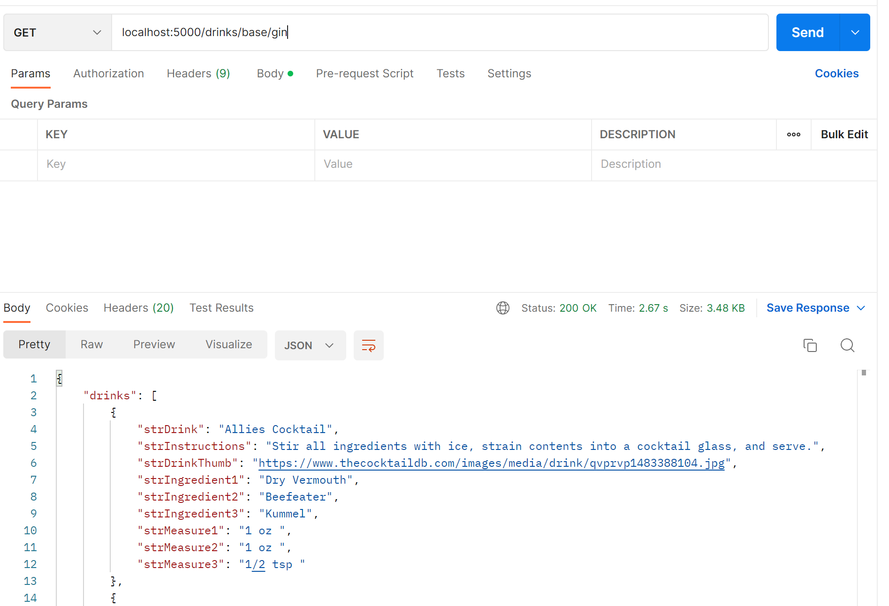
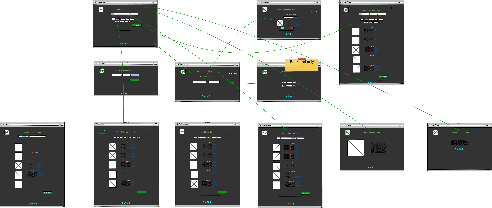

## 3 T3A2-B Full Stack App
# Shkr! app <br/><br/>

A MERN Application built by Patrick Hamer and Anastasia Dyakova(aka Nassy Kova)
<br>
 [Patrick Hamer](https://github.com/Patrick655321)
<br>
 [Nassy Kova](https://github.com/NassyKova/)


  * [App description](#app-description)
    + [Purpose](#purpose)
    + [Functionality / Features](#functionality---features)
      - [The Library (drinkControllers)](#--the-library---drinkcontrollers----)
    + [Target audience](#target-audience)
  * [Links](#links)
    + [System requirements](#system-requirements)
    + [Server Installation](#server-installation)
    + [Client Installation](#client-installation)
  * [API Endpoints](#api-endpoints)
  * [Server Libraries and Dependencies](#server-libraries-and-dependencies)
    + [Server Libraries](#server-libraries)
    + [Server Development Dependencies](#server-development-dependencies)
  * [Client Libraries and Dependencies](#client-libraries-and-dependencies)
    + [Client Libraries](#client-libraries)
    + [Client Development Dependencies](#client-development-dependencies)
  * [Frontend testing](#frontend-testing)
  * [Backend testing](#backend-testing)
    + [JEST](#jest)
  * [Application Screenshots](#application-screenshots)
  * [Difference with original plan](#difference-with-original-plan)
    + [Wireframes at the planning stage](#wireframes-at-the-planning-stage)
    + [Wireframes at the deployed stage](#wireframes-at-the-deployed-stage)
  * [Trello](#trello)

## App description
A big thanks is owed to [TheCocktailDB](https://www.thecocktaildb.com/api.php) for providing us with the cocktail database we used as a 3rd party resource. Not only did it save us from creating a whole new database which would have cost us considerable time, but also gave us real world experience of dealing with data that is not necessarily what you need for your particular app, thus leading to greater understanding of functions, classes, modular coding and DRY coding. Retrieving the data we wanted was sometimes complex due to the structure of the database which really enriched the learning experience.

It is worth noting before we begin that the entirety of the page was not deployed in the frontend. Certain features were created for the backend, tested and deployed but code was never created for the front end due to time constraints. All endpoints are available through postman for the purposes of testing and marking, however not all of these features are available on the live app.
The rebranding endpoint, the user login and the age verification are the main culprits.
The use of authorization has been removed from the app but the backend remains in the source code should educators wish to test it.
If it is unclear how to use any of these functions please refer to the testing section, particularly the POSTMAN section on how req.body should be structured and sent.

### Purpose
The Shkr app is a simple, intuitive app designed to help people learn new cocktail recipes or look up old favourites. It also has the functionality to allow brands to manipulate data that the client sees so that they can maintain prominent placement of their brands as well as remove specific cocktails that may not comply with their portfolio.

### Functionality / Features
There are two main sections of functionality within the app which are the library for the end user as well as the admin functionality for the spirits rep/brand ambassador.
#### **The Library _(drinkControllers)_**
The library consists of a simple interface linking the user to an existing cocktail library. Due to time constraints we did not have the ability to create our own library of drinks so we opted for using an external API. The big difference here is the data that is retrieved. The user can search for dirnks in the following ways. It is worth noting that all of the search functions are passed through filtering functions that will be discussed at the end of the list.
- By name: Will retrieve an array of objects that all have the requested title somewhere in their name (strDrink). This will actually retrieve _too much_ in that it retrieves the entire entry in the external API for each drink which includes both italian and french versions of the alread excessive information we get back.
- By Base: Will retrieve an array of objects that all share a common ingredient eg. base. Information initially returned is name (strDrink), id (str) and the link to the picture (strDrinkThumb). This is far from enough info for our needs.
- By Fruity: In the app there is a discreet list of ingredients that would produce a fruity drink. This function loops through each item on that list and compiles a new list of all the drinks that contain one or more of the ingredients. Again only returning name, id and picture.
- By Fizzy: Lemonade, soda water, champagne. You know, bubbles. Fizz! This works the same as the fruity list however iterates through a list of infredients that contain fizz to create a list of effervescent bevvies, also lacking any information beyond name, id and photo.
- By Heavy: This is for when you want a stiff drink or have a premium product to savor. This has a list of spirits to compare to and only returns drinks that _have_ alcohol and have 3 ingredients or less. Limited info applies to this one too, but we'll get to that.
- By Non-Alc: I don't drink and ride my motorbike, which means when I'm out, I don't drink. This simply returns an array of alcohol-free drinks, again with the limited info.

**Library functions _(utils)_**
This was both the most challenging and the most fun part of the assignment for me. Negotioating an external API, my own code and a local database... What a ride. Each of the search results needs top be passed through various filters for various reasons. They are as follows:
- ModifyResponse: This takes the returned information and compares the ingredients with a database containing brand substitutions. If an ingredient is, for example "Rum" and the database hass rum's brand listed as "Plantation" then Plantation will be substituted for all listed ingredients. 
- extrapDetails: This function takes the list returned by the external API, pulls the ID for each drink returned and creates a new array with them in it. It then proceeds fetch all the data for each ID but only returning the specific information required for this app, in this instance Name, Picture, Ingredients, Measures and instructions. It then passes this information through modifiedResponse to make appropriate brand adjustments.
- randomizer: This function picks a random number between one and the length of the array it is given.
- takeForbidden: This function filters our any drink that's name (strDrink) matches one of the items in the forbidden array in the database.
- getRandomFive: This function recieves an arraay and first runs the forbidden function on it, then checks to see if the array is 5 or less. If so, the array is returned. If not it hten employs the randomizer function to indexes from the array and adds the corresponding object to a new array. If the new array already contains the object it will not be added. It proceeds to do this until the new array reaches 5([4]) and then returns it.

**Admin functions**
Admin functionality is fairly simple for this app. The database is compared ot the search results for each search and given we don't actually want to change the data in the database (nor can we, as we learned _after_ paying our subscription to their Patreon) every time we want to do a rebranding we decided filters would be the best option. The filters have been described above, however here is how they can be manipulated:
- rebrandSpirit: allows the user to enter a new name for the spirit. The spiritName is preset whereas the newBrand is a text field for the user to input their desired string. The body of the request is structured like so:
```
{ 
  spiritName: "Name of key to spirit we want to change."
  newBrand: "New brand we want replacing this spirit when searched"
}
```

- addToForbidden: This takes a string and adds it to the forbidden array using a text input. It's body is structured:
```
{
  drink: "Cocktail to be forbidden"
}
```
- removeForbiddenItem: This again accepts a string but this time removes the item from the forbidden array. It's body is structured:
```
{
  drink: "Cocktail to be removed from forbiddenList
}
```
It is worth noting that in the interests of this assignment all of these functions actually retrieve the id for the single document in the database and autmatically put it in. This was an issue we ran into when I was reinstalling mongo and realised that I had hard-coded the ID in, thus making it an instant-crash scenario as soon as it left my local environment. To do this the function calls the ReturnMod model and pulls the object id and places it in a variable which it then uses throughout the rest of the function.


### Target audience

There are three main demographics we are aiming this app at. The first was cocktail enthusiasts. This provides an easy way to find new recipes with the randomization of the generalized searches and the ability to search by base.
The next group were bartenders. Having a phone-accessible cocktail library on you at all times makes the job a whole lot easier, as well as allowing you to explore new ideas. This group was particularly considered for the search by name functionality as there is always someone in your bar from overseas who wants a drink you ahve never heard of before and all they can tell you is it was 'nice'.
The last demographic, and possibly the most important as these would be the people we would be expecting to pay for our app, are the big brands. Brands like Hennessy-Moet-Chandon or Pernod-Ricard or Diageo. These guys would reap two benefits from this app. Firstly they would get more consistent quality products across all venues they rolled this app out to, but more importantly the brand replacement/forbidden list would allow them to not only keep the brands in their stable front and center when bartenders and booze-nerds are looking up recipes, but more importantly _change_ that branding at a moments notice. Imagine rolling out a nationwide promotion for a new liquor and instantly being able to change the recipe book to include that new brand wherever possible, only to change it back to a house brand again once the promotion is over.


## Links

Deployed Application: [https://shkrapp.netlify.app](https://shkrapp.netlify.app)

Staging Environment: [https://shakr-backend-production.up.railway.app/](https://shakr-backend-production.up.railway.app/)

Server Repo: [https://github.com/Patrick655321/Shakr--Backend](https://github.com/Patrick655321/Shakr--Backend)

Client Repo: [https://github.com/NassyKova/shkr_frontend](https://github.com/NassyKova/shkr_frontend)

Part A Documentation: [https://github.com/NassyKova/Cocktail](https://github.com/NassyKova/Cocktail)


### System requirements

- NodeJS version v18.12.1


### Server Installation

- Create a directory called `shkr_front` and navigate into that directory.
  - `$ mkdir shkr_back && cd shkr_back`
- Once in the `/shkr_back` directory, in the terminal run the following command:
  - `git clone git@github.com:Patrick655321/Shakr--Backend.git`
- Install npm packages
  - `npm install`
- If a `.env` file has not been provided to you, create one and fill it out using the fields provided in the `.env.sample` file
- Run the server with the following command:
  - `npm run dev`
- This will run the server using nodemon

The API can now be accessed using Postman and `localhost:3000/`

### Client Installation

- Open the terminal and navigate to the `shkr_front` folder
  - `$ cd shkr_front`
- Once in the `/shkr_front` directory, in the terminal run the following command:
  - `git clone git@github.com:NassyKova/shkr_frontend.git`
- Install npm packages
  - `npm install --legacy-peer-deps`
- run the server with the following command:
  - `npm run dev`
- By default the server will run at `http://localhost:5000/`

## API Endpoints

drinkRouter.get("/drinks/name/:drinkName", getDrinkByName);  
    Request Verb: GET  
    Function: Retrieves 5 random cocktails by name entered by user (eg Margarita will return all drinks with that string in their name)
    Authentication: N/A  
    Authorization: N/A  
    Example Response:  
```Javascript
{
  "drinks": [
    {
      "strDrink": "Whitecap Margarita",
      "strInstructions": "Place all ingredients in a blender and blend until smooth. This makes one drink.",
      "strDrinkThumb": "https://www.thecocktaildb.com/images/media/drink/srpxxp1441209622.jpg",
      "strIngredient1": "Ice",
      "strIngredient2": "New tequila brand",
      "strIngredient3": "Cream of coconut",
      "strIngredient4": "Lime juice",
      "strMeasure1": "1 cup ",
      "strMeasure2": "2 oz ",
      "strMeasure3": "1/4 cup ",
      "strMeasure4": "3 tblsp fresh "
    },
 ```

drinkRouter.get("/drinks/base/:drinkBase", getDrinkByBase);  
    Request Verb: GET  
    Function: Retrieves 5 random cocktails by selected base ingredient (buttons on client side)  
    Authentication: N/A  
    Authorization: N/A  
    Example Response:  
```Javascript
    {
    "drinks": [
        {
            "strDrink": "Barracuda",
            "strInstructions": "Shake pour ingredients with ice. Strain into glass, top with Sparkling wine.",
            "strDrinkThumb": "https://www.thecocktaildb.com/images/media/drink/jwmr1x1504372337.jpg",
            "strIngredient1": "Mount Gay Eclipse",
            "strIngredient2": "Galliano",
            "strIngredient3": "Pineapple Juice",
            "strIngredient4": "Lime Juice",
            "strIngredient5": "Prosecco",
            "strMeasure1": "4.5 cl",
            "strMeasure2": "1.5 cl",
            "strMeasure3": "6 cl",
            "strMeasure4": " 1 dash",
            "strMeasure5": "top up "
        }
```


drinkRouter.get("/drinks/non-alc", getDrinkByNonAlc);  
Request Verb: GET  
    Function: Retrieves 5 random cocktails from the non-alcoholic list in the external API  
    Authentication: N/A  
    Authorization: N/A  
    Example Response:  

```Javascript
{
    "drinks": [
        {
            "strDrink": "Grape lemon pineapple Smoothie",
            "strInstructions": "Throw everything into a blender and liquify.",
            "strDrinkThumb": "https://www.thecocktaildb.com/images/media/drink/54z5h71487603583.jpg",
            "strIngredient1": "Grapes",
            "strIngredient2": "Lemon",
            "strIngredient3": "Pineapple",
            "strMeasure1": "1 cup ",
            "strMeasure2": "1/4 ",
            "strMeasure3": "1/2 "
        },
```

drinkRouter.get("/drinks/fruity", getDrinkByFruity);  
Request Verb: GET  
    Function: Retrieves 5 random cocktails that contain an ingredient that is included in the fruityList in utils/arrayInfo  
    Authentication: N/A  
    Authorization: N/A  
    Example Response:  
```Javascript
{
    "drinks": [
        {
            "strDrink": "Lassi - Mango",
            "strInstructions": "Put it all in a blender and pour over crushed ice. You can also use other fruits like strawberries and bananas.",
            "strDrinkThumb": "https://www.thecocktaildb.com/images/media/drink/1bw6sd1487603816.jpg",
            "strIngredient1": "Mango",
            "strIngredient2": "Yoghurt",
            "strIngredient3": "Sugar",
            "strIngredient4": "Water",
            "strMeasure1": "2 ",
            "strMeasure2": "2 cups ",
            "strMeasure3": "1/2 cup ",
            "strMeasure4": "1 cup iced "
        },
```


drinkRouter.get("/drinks/fizzy", getDrinkByFizzy);  
Request Verb: GET  
    Function: Retrieves 5 random cocktails that contain an ingredient that is included in the fizzyList in utils/arrayInfo  
    Authentication: N/A  
    Authorization: N/A  
    Example Response:  
```Javascript
{
    "drinks": [
        {
            "strDrink": "Brandon and Will's Coke Float",
            "strInstructions": "Scoop two large scoops of vanilla ice-cream into frosted beer mug. Next, add 2 ounces Maker's Mark. Then, pour in coke. Gently stir and enjoy.",
            "strDrinkThumb": "https://www.thecocktaildb.com/images/media/drink/xspxyr1472719185.jpg",
            "strIngredient1": "Vanilla ice-cream",
            "strIngredient2": "Coca-Cola",
            "strIngredient3": "Woodford Reserve",
            "strMeasure1": "2 scoops ",
            "strMeasure2": "1 can ",
            "strMeasure3": "2 oz "
        },
```
drinkRouter.get("/drinks/heavy", getDrinkByHeavy);  
Request Verb: GET  
    Function: Retrieves 5 random cocktails that contain an at least one alcoholic ingredient and no more than 3 ingredients.  
    Authentication: N/A  
    Authorization: N/A  
    Example Response:  
```Javascript
{
    "drinks": [
        {
            "strDrink": "Addison Special",
            "strInstructions": "Combine ingredients in the order listed into a shaker. Fill half full with ice and shake well. Strain into glass with ice and garnish with a cherry and orange wedge.",
            "strDrinkThumb": "https://www.thecocktaildb.com/images/media/drink/4vo5651493068493.jpg",
            "strIngredient1": "Grey Goose",
            "strIngredient2": "Grenadine",
            "strIngredient3": "Orange juice",
            "strMeasure1": "1 shot ",
            "strMeasure2": "1 tblsp ",
            "strMeasure3": "Fill with "
        },
```

returnModRouter.put("/products/brand/:id", rebrandSpirit)  
Request Verb: PUT  
    Function: Assigns new value (req.body.newBrand) to appropriate key (req.body.spiritName)  
    Authentication: N/A  
    Authorization: N/A  
    Example Response: 
```Javascript
    {
    "_id": "6408199ef6eeb96704d4269b",
    "vodka": "Belvedere",
    "rum": "Mount Gay",
    "scotch": "Ballentine's",
    "bourbon": "Woodford Reserve",
    "tequila": "El Jimador",
    "gin": "Beefeater",
    "forbidden": [
        "Martini",
        "margarita",
        "Dirty Martini"
    ]
}
```
    
returnModRouter.post("/products/forbidden/add", addToForbidden)  
Request Verb: POST  
    Function: Adds item (req.body.drink) to forbidden list  
    Authentication: N/A  
    Authorization: N/A  
    Example Response:  
```Javascript
    {
    "_id": "6408199ef6eeb96704d4269b",
    "vodka": "Grey Goose",
    "rum": "Mount Gay",
    "scotch": "Ballentine's",
    "bourbon": "Woodford Reserve",
    "tequila": "El Jimador",
    "gin": "Beefeater",
    "forbidden": [
        "Martini",
        "margarita",
        "Dirty Martini"
        "${req.body.drink}"
    ]
}
```

returnModRouter.patch("/products/forbidden/remove", removeForbiddenItem)  
Request Verb: PATCH  
    Function: removes item (req.body.drink) from forbidden list  
    Authentication: N/A  
    Authorization: N/A  
    Example Response:  
```Javascript
    {
    "_id": "6408199ef6eeb96704d4269b",
    "vodka": "Grey Goose",
    "rum": "Mount Gay",
    "scotch": "Ballentine's",
    "bourbon": "Woodford Reserve",
    "tequila": "El Jimador",
    "gin": "Beefeater",
    "forbidden": [
        "Martini",
        "margarita",
        "Dirty Martini"
    ]
}
```


## Server Libraries and Dependencies

### Server Libraries

`mongoose ^6.8.4"`- Mongoose is a MongoDB object modeling tool designed to work in an asynchronous environment. Mongoose supports Node.js and Deno (alpha).

`express ^4.18.2` - Express is a minimal and flexible Node.js web application framework that provides a robust set of features for web and mobile applications.

`dotenv ^16.0.3` - Dotenv is a zero-dependency module that loads environment variables from a .env file into process.env. Storing configuration in the environment separate from code is based on The Twelve-Factor App methodology.

`cors ^2.8.5"` - CORS is a node.js package for providing a Connect/Express middleware that can be used to enable CORS with various options.

`axios ^1.3.4` - Axios is promise-based HTTP client for javascript. It is a simpler way to modify request/response before they have started as well as being able to transform the data (eg. automatically stringifies data when sending objects to API).

`moment ^2.29.4` - Moment is a library that simplifies the handling, manipulation and presentation of date/time in a human-readable form.

### Server Development Dependencies

`jest ^29.4.1` - Jest is a JavaScript testing framework that allows developers to run tests on JavaScript and TypeScript code and can be easily integrated with React JS.

`supertest ^6.3.3` - A Node.js library for testing APIs. Provides high level abstraction for testing.

`nodemon ^2.0.20` - Nodemon is a popular tool that is used for the development of applications based on node. js. It simply restarts the node application whenever it observes the changes in the file present in the working directory of your project.

## Client Libraries and Dependencies

### Client Libraries

`react: ^18.2.0` - React is a free and open-source front-end JavaScript library for building user interfaces based on components. It is maintained by Meta and a community of individual developers and companies.

`react-dom: ^18.2.0` - The react-dom package provides DOM-specific methods that can be used at the top level of your app and as an escape hatch to get outside the React model if you need to.

`react-router-dom: ^6.8.1` - React-router is the core package containing standard components and functionalities to implement routing in React applications.

`react-bootstrap: "^2.7.2`- React-Bootstrap replaces the Bootstrap JavaScript. Each component has been built from scratch as a true React component, without unneeded dependencies like jQuery

`axios: "^1.3.4` - Axios is used to communicate with the backend and it also supports the Promise API that is native to JS ES6.


`react-scripts: "5.0.1"` - React-scripts are simply scripts to run the build tools required to transform React JSX syntax into plain JavaScript programmatically.

`styled-components: "^5.3.6"` - Using tagged template literals and arrow functions in ES6+ and CSS, styled-components is a React-specific CSS-in-JS styling solution that creates a platform for developers to write actual CSS code to style React components, as well as in React Native.


Component libraries:
- `mui` - @mui/material: ^5.11.10,
- `antd` - antd: ^5.2.1,
- `emotion` - @emotion/react: "^11.10.5, @emotion/styled: ^11.10.5,


### Client Development Dependencies

`vite": "^4.0.0` - Vite allows developers to setup and build a front-end development environment for React that contains a dev server. It also has the feature of a Hot Module Reload which updates the server with changes to the codebase.

`@testing-library/jest-dom: ^5.16.5`

`@testing-library/react: ^13.4.0`

`@types/react: ^18.0.26`

`@types/react-dom: ^18.0.9`

`@vitejs/plugin-react: ^3.0.0`

`jsdom: ^21.1.0`

`vitest: ^0.28.3`

## Frontend testing 


## Backend testing 
### JEST
Backend testing was performed in two ways for this assignment, with Postman poving to be invaluable and Jest/Supertest being used to make sure everything was tickety-boo before submission or after any minor alterations. 
Jest Testing comprised of 2 suites, one of admin functionality and one for search functionality.

**SEARCH TESTING**

The initial server connecting test was used to make sure I was actually online and sadly was required more than I would like to admit.
```Javascript
describe("GET localhost:5000", () => {
    it("shows welcome message", async() => {
        const response = await request(app).get("/") //Connecting to the home page and making sure that it is connecting to server
        expect(response.statusCode).toBe(200) //connected
        expect(response.text).toEqual(expect.stringContaining("Welcome")) //Welcome message displayed, ensuring that it was displayed correctly
    })
})
```

After the initial ocnnection each search had to have its own collection of tests. The test for getDrinkByName:
```Javascript
describe("GET /drinks/name/:drinkName", () => {
    it("each object in the array contains a key-value pair where strDrink contains 'margarita'", async() => {
        const response = await request(app).get("/drinks/name/margarita")
        const { drinks } = await response.body; 
        expect(response.statusCode).toBe(200)
        expect(Array.isArray(drinks)).toBe(true);
        expect(response.body.drinks.length).toBeLessThanOrEqual(5);
        drinks.forEach(drink => {
            expect(drink.strDrink.toLowerCase()).toContain("margarita");
        });
      });
    })
```
This test sends a request to the server. After checking that the request gets a status of 200 and returns an array and one that is less than or equal to 5 items long (which all of the search tests check for), this test then proceeds to ensure that the original search params, in this case 'margarita' are being returned

```Javascript

    describe("GET /drinks/name/:drinkName", () => {
      it("Checking that search params accept whitespace and are NOT case sensitive", async() => {
        const response = await request(app).get("/drinks/name/OLD fasHIOned ")
        const { drinks } = await response.body;
        drinks.forEach(drink => {
          expect(drink.strDrink.toLowerCase()).toContain("old fashioned");
      })
    })
  })
  ```
This was added to ensure that the cleaning of strings was working. I have an inherant distrust of anything that requires user input beyond buttons or radios. This test ensured that search params were not caser sensitive, were being trimmed and were compensating for any whitespace used.

The getDrinksByBase function:
```Javascript
describe("GET /drinks/base/:drinkBase", () => {
    it("Check to see if every object returned contains at least one ingredient that is the equivelant of vodka's brand", async() => {
        const response = await request(app).get("/drinks/base/vodka")
        const { drinks } = await response.body;
        const products = await ReturnMod.find({});
        expect(response.statusCode).toBe(200)
        expect(Array.isArray(drinks)).toBe(true);
        expect(response.body.drinks.length).toBeLessThanOrEqual(5);
        const hasVodka = drinks.some(drink => Object.values(drink).includes(products[0].vodka));
        expect(hasVodka).toBe(true);
    })
})
```
searched for dirnks containing vodka, and ensured that every drink returned did in fact contain that ingredient. The user input in this case was buttons so not as much sanitizing was required.

The next two, getDrinkByFruity and getDrinkByFizzy were very similar:
```Javascript
describe("GET /drinks/fruity", () => {
  it("Ensure every drink in the returned array has an ingredient from the fruitList array", async() => {
    const response = await request(app).get("/drinks/fruity")
    const { drinks } = await response.body;
    const formattedFruitList = fruitList.map((value) => cleanString(value.replace('_', ' ')));
    const filteredDrinks = drinks.filter((drink) =>
  Object.values(drink).map((value) => cleanString(value)).some(
    (value) => formattedFruitList.includes(value)
  )
);
    expect(response.statusCode).toBe(200)
    expect(Array.isArray(drinks)).toBe(true);
    expect(response.body.drinks.length).toBeLessThanOrEqual(5)
    expect(filteredDrinks).toHaveLength(5)
  })
})

describe("GET /drinks/fizzy", () => {
    it("Ensure every drink in the returned array has an ingredient from the fruitList array", async() => {
      const response = await request(app).get("/drinks/fizzy")
      const { drinks } = await response.body;
      const formattedFizzList = fizzList.map((value) => cleanString(value.replace('_', ' ')));
      const filteredDrinks = drinks.filter((drink) =>
        Object.values(drink).map((value) => cleanString(value)).some(
          (value) => formattedFizzList.includes(value)
        )
      );
      expect(response.statusCode).toBe(200)
      expect(Array.isArray(drinks)).toBe(true);
      expect(response.body.drinks.length).toBeLessThanOrEqual(5)
      expect(filteredDrinks).toHaveLength(5)
  })
})
```

In the functions themselves I was using an array of keywords with which to conduct the search. Upon creating these tests I shifted all the arrays into a file in the utils fodler so as to keep the code DRY and imported them to both their functions and these tests. The tests request a list of drinks using the function and then using the same list as the function itself makes sure that every drink contains at least one ingredient from it's respective array. The method here is to filter through and create a new array of drinks that contain that ingredient which must be equal to 5, or the same amount as the returned drinks list was in the beginning.

getDrinkByNonAlc: 
```Javascript
describe("GET /drinks/non-alc", () => {
  it("Ensure every drink in the returned array has an ingredient from the fruitList array", async() => {
    const response = await request(app).get("/drinks/non-alc")
    const { drinks } = await response.body;
    const formattedSpiritList = spiritList.map((value) => cleanString(value.replace('_', ' ')));
    const filteredDrinks = drinks.filter((drink) =>
      Object.values(drink).map((value) => cleanString(value)).some(
        (value) => formattedSpiritList.includes(value)
      )
    );
  expect(response.statusCode).toBe(200)
  expect(Array.isArray(drinks)).toBe(true);
  expect(response.body.drinks.length).toBeLessThanOrEqual(5)
  expect(filteredDrinks).toHaveLength(0)
})
})
```
used similar functionality in its testing however when creating the array it used the spiritList used in the getDrinkByHeavy search. This was a list of all the basic spirits and the returned results of this call were filtered into a new array of all the drinks that contained a spirit, thus the expected length of the array was 0 instead of 5.


getDrinkByHeavy was an extension of the above principle, but this time required pulling information from Mongo as well:
```Javascript
describe("GET /drinks/heavy", () => {
  it("Ensure every drink in the returned array has an ingredient from the spiritList array and that no drink contains more than 3 ingredients", async() => {
    const response = await request(app).get("/drinks/heavy")
    const { drinks } = await response.body;
    const formattedSpiritList = spiritList.map((value) => cleanString(value.replace('_', ' ')));
    const filteredDrinks = drinks.filter((drink) =>
      Object.values(drink).map((value) => cleanString(value)).some(
        (value) => formattedSpiritList.includes(value)
      )
    );
    const products = await ReturnMod.find({});
    const id = products[0]._id
    const document = await ReturnMod.findById(id).lean().exec();
    const values = Object.values(document);
    const formattedValues = values
      .filter((val) => val && typeof val === 'string')
      .map((val) => cleanString(val.replace('_', ' ')));
    const filtered2 = drinks.filter((d) =>
    Object.values(d).map((v) => cleanString(v)).some(
      (v) => formattedValues.includes(v)
    )
  );
    const ingredient4Check = drinks.filter((drink) =>
  drink.hasOwnProperty('strIngredient4')
);
  expect(response.statusCode).toBe(200)
  expect(Array.isArray(drinks)).toBe(true);
  expect(response.body.drinks.length).toBeLessThanOrEqual(5)
  expect(filteredDrinks.length + filtered2.length).toBeGreaterThanOrEqual(5)
  expect(ingredient4Check).toHaveLength(0)
})
})
```
In this function the same process is gone through as in the orther searchBy functions, however do to hte rebranding function taking place before the results were returned I was running into a problem that instead of returning what was on the spiritsList, say, vodka, I was getting a return of what the rebrand function had changed vodka too, for example Grey Goose. This time I pulled a list of all the key values from the DB and compared them with the ingtredients of the search results, creating an ew array. I then added the length of the first array to the length of the second array to ensure that the list was > 5 items long. This was to ensure that any double ups didnt throw an error. I did not remove duplicates due to time constraints.

Also worth noting in here is the cleanString function:
```Javascript
const cleanString = (str) => str.toLowerCase().replace(/_/g, ' ').replace(/[^a-z0-9]+/g, '').trim();
```
This was used to ensure that all comparisons were made with matching strings. Due to inconsistencies in the external database's use of whtespace, underscores capitalization etc, this function used some regex to ensure that the all _ were being replaced with " ", that only alphanumeric characters were being read, and that any extra whitespace was trimmed from the front and back of all strings. This function was then incorporated in other areas throughout the project. I will probably keep a copy of it stuck to my computer until it is committed to memory if I'm being honest as it was extremely useful.

**ADMIN TESTING**
Admin testing with Jest required a little more dash to achieve as it required sending information. I used a local db to do this, however given the redundancy at this stage of some of the backend I have left it connected to the standard database for educator inspection.
The rebrand test:
```Javascript
describe("PUT /products/swap", () => {
    it("swaps brands out", async() => {
      const response = await request(app).put("/products/brand/swap")
      .send({
        spiritName: "test_spirit",
        newBrand: "Old Mate Patty's Mountain Moonshine!"
      })
      expect(response.statusCode).toBe(200)
      expect(response.body.test_spirit).toEqual("Old Mate Patty's Mountain Moonshine!")
    })
  })
```
simply sent a new brand to "test_spirit" in the db and then checked the return top make sure it had landed.

The addForbidden test:
```Javascript
describe("POST /products/forbidden/add", () => {
    it("add item to forbidden array", async() => {
      const response = await request(app)
      .post("/products/forbidden/add")
      .send({
        drink: "Rocket fuel"
      });
      expect(response.statusCode).toBe(200);
      expect(response.body.forbidden[response.body.forbidden.length - 1]).toEqual("Rocket fuel")
      const failResponse = await request(app)
        .post("/products/forbidden/add")
        .send({ drink: "Rocket fuel"});
      expect(failResponse.status).toBe(400)
    })
  })
```
sent a drink called "Rocket Fuel" to be added to the forbidden list in the DB. After this it checked to make sure that it had been added to the end of the array but most importantly it sent the same request _again_ to ensure that it would be denied, that the same drink could not be added twice to the forbidden array, which would cause unnecessary coding-clutter.

The removeForbidden test simply sent the drink to be removed and then ensured that the forbidden array no longer contained said drink.
```Javascript
 describe("PATCH /products/forbidden/remove", () => {
    it("remove item from forbidden array", async() => {
      const response = await request(app).patch("/products/forbidden/remove")
      .send({
        drink: "Martini"
      })
      expect(response.statusCode).toBe(200);
      expect(response.body.forbidden.includes("Martini")).toBe(false)
    })}) 
```
One of the happiest moments of this whole project was definitely when I received and I knew I had a running app that was conforming to what I had asked it to do.:  


While Jest and supertest were incredibly useful for the final product, along the way to figure out what kind of data I was receiving or to debug I used postman. A lot.
For the admin functions it was as simple as making sure they were doing as they were told in real time:

Such as here when I was wanting to ensure the branding had swapped as planned, or  

  

here to make sure that items were being added to the forbidden array, as well as being removed:  

  

I also used postman just to keep an eye one which brands I had in my DB and also how it was structured while I worked out how to manipualte that information:  


This real time testing afforded me the opportunity to see where problems were using both Postman and the console.log function and remedy them, seeing results immediately. The peripheral benefit was picking up on things like capitalization and punctuation throughout search results ad adjsuting my code to accommodate.

Postman was also great to see _what kind_ of data I was getting back. If we take a look at the initial return on a single drink:  
  
We can see that I was getting _way_ too much back, and in german and italian to boot. This let me know the keys I needed to keep and also how the returns were structured so as I filtered them I could strip away layers of redundancy. Also, when searching by broad thingsl ike ingredients or glassware, information returned was limited:
    
so using postman (although this is clearly a chrome shot, the initial work was done with postman) I was able to see what exactly was being returned and then manipulate these results to return more data, and specifically, the data we required.
  


Beyond these examples testing of other redundant code was performed using POSTMAN to ensure it worked, however once it was ascertained that we would not be using it in the final prooduct Jest testing was omitted in the interests of time and efficiency.

## Application Screenshots
???????????

## Difference with original plan

During the building stage we decided to prioritise the main function and move the rest to "Nice to have". 
- Replace spirits function implemented in the back end only
- Age verification, admin login with password, product opened in separate window were not implemented
### Wireframes at the planning stage
 
 
 ### Wireframes at the deployed stage
 

## Trello
Trello Board: [https://trello.com/b/mkjckRkJ/shakr-backend](https://trello.com/b/mkjckRkJ/shakr-backend)

From an initial Trelloboard:
  

That had a list all of ourt tasks, we gradually developed our knowledge and understanding of how to use trello and created task assignment board that was much more informative at just a quick glance:  

  

adding screenshots to cards was useful to let each other know what was happening, especially as we kept slightly different hours and one of us may be working at 6AM or the other working at midnight depending.  Assigning tasks was useful too especially as a lot of the tasks overlapped, for example search functionality. Knowing that we could skip over each others cards in the pursuit oof ticking off our own checklist was very helpful. Labels were just awesome too. As cliche as it sounds, when you're in the zone coding and just having a good day of it it's great to just knock tasks out one after another.
